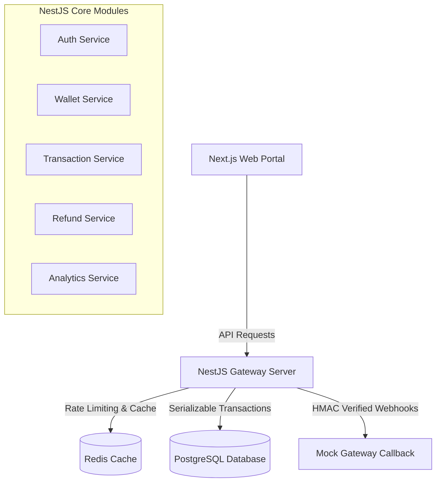

# Fintech Payment Gateway & Wallet Management System

A production-grade, highly secure, and concurrency-safe fintech payment gateway and wallet management system. This system supports candidate wallet top-ups, instant application payment processing, multi-stage transaction state transitions, administrator-approved refund workflows, peer-to-peer (P2P) transfers with deadlock prevention, and real-time dashboard analytics.

---

## 🏗️ System Architecture

The application is structured as a decoupled monorepo containing:
1. **NestJS Backend**: Modular backend framework featuring TypeORM, PostgreSQL, Redis caching, rate limiting, and Winston structured logging.
2. **Next.js Frontend**: Portal featuring dynamic dark mode, TanStack React Query for state synchronization, and Recharts for interactive analytics.



---

## 🛠️ Tech Stack

### Backend
* **Framework**: NestJS (v11.x)
* **ORM**: TypeORM (v0.3.x) with PostgreSQL driver
* **Database**: PostgreSQL (v16+)
* **Caching & Sessions**: Redis (ioredis) & NestJS Throttler
* **Security & Auth**: Passport JWT, Bcrypt password hashing, Crypto HMAC signature validation
* **Logging & Telemetry**: Winston Logger with request-scoped `X-Correlation-ID` tracing

### Frontend
* **Framework**: Next.js (v16.x) App Router
* **Styling**: Tailwind CSS v4 (Sleek dark mode) & Vanilla CSS variables
* **Icons**: Lucide React
* **State Management & Fetching**: TanStack React Query (v5)
* **Visualization**: Recharts (v3)

---

## ⚙️ Environment Variables

### Backend Configuration (`backend/.env`)
Create a `.env` file at the root of the `backend/` directory:
```env
PORT=3001
NODE_ENV=development

# Database Connection
DB_HOST=localhost
DB_PORT=5432
DB_USERNAME=postgres
DB_PASSWORD=your_db_password
DB_NAME=payment_gateway_db
DB_POOL_MIN=2
DB_POOL_MAX=10

# Redis Cache & Sessions Connection
REDIS_HOST=127.0.0.1
REDIS_PORT=6379

# Cryptographic Keys & Bot Protection
WEBHOOK_SECRET=your_webhook_secret_key
TURNSTILE_SECRET_KEY=1x00000000000000000000000000000000UNSHIELD
NEXT_PUBLIC_TURNSTILE_SITE_KEY=1x00000000000000000000AA
```

### Frontend Configuration (`payment_gateway/.env.local`)
Create a `.env.local` file inside the `payment_gateway/` directory:
```env
NEXT_PUBLIC_API_URL=http://localhost:3001/api
NEXT_PUBLIC_TURNSTILE_SITE_KEY=1x00000000000000000000AA
```

---

## 🚀 Setup & Installation Steps

Follow these instructions to clone, configure, seed, and run the project locally.

### 1. Prerequisites
Ensure you have the following installed and running on your system:
* **Node.js**: v20 or higher
* **PostgreSQL**: Running database on port `5432`
* **Redis**: Running cache server on port `6379`

### 2. Clone the Repository
```bash
git clone <repository_url>
cd payment_gateway
```

### 3. Backend Setup & Database Seeding
Navigate to the `backend` directory, install dependencies, prepare the database, and seed the demo data (this is required to generate the dummy candidate users, admins, and mock transactions):
```bash
cd backend
npm install

# 1. Verify and create the PostgreSQL database
node scripts/init-db.js

# 2. Re-apply DB schema and seed demo dataset
# (Generates 1 Admin, 10 Users, 60 Transactions, and 5 Refund requests)
node seed-demo.js
```

### 4. Run the Backend API Server
```bash
# Start in development mode (hot-reloading enabled)
npm run start:dev

# Or build and start in production mode
npm run build
npm run start:prod
```
The NestJS server will start listening on `http://localhost:3001/api`.

### 5. Frontend Setup & Run
Open a new terminal session, navigate to the `payment_gateway` directory, install dependencies, and launch the portal:
```bash
cd payment_gateway
npm install

# Start Next.js development server
npm run dev
```
Open [http://localhost:3000](http://localhost:3000) in your browser to access the portal.

---

## 🔑 Default Demo Credentials
Seeding generates standard testing profiles configured with the password `Subham@1234` and the transaction PIN `123456` (configured via setup screens):

| Role | Username | Initial Balance | Password |
| :--- | :--- | :---: | :--- |
| **Candidate (User)** | `user@regilly.com` | ₹2,500.00 | `Subham@1234` |
| **Administrator** | `admin@regilly.com` | ₹10,000.00 | `Subham@1234` |

---

## 📋 API Documentation

All state-changing endpoints (POST, PATCH, DELETE) require a valid CSRF token passed via the `X-CSRF-Token` header.

### 🔒 Authentication (`/api/auth`)
* `POST /api/auth/register`
  - **Description**: Registers a new standard user account.
  - **Payload**: `{ name, email, password, confirmPassword, captchaId, captchaValue }`
* `POST /api/auth/login`
  - **Description**: Authenticates users and initiates a session cookie.
  - **Payload**: `{ email, password, captchaId, captchaValue }`
* `POST /api/auth/logout`
  - **Description**: Clears the active session and expires the session cookie.
* `GET /api/auth/me`
  - **Description**: Retrieves current session's profile info.
* `GET /api/auth/csrf`
  - **Description**: Retrieves a fresh CSRF token for the session.
* `GET /api/auth/captcha-required`
  - **Description**: Checks if Turnstile bot protection is required based on failed logins.
* `GET /api/auth/captcha`
  - **Description**: Returns a distorted random math/text SVG CAPTCHA (2-minute expiry).
* `POST /api/auth/create-admin`
  - **Description**: Allows an admin to register another admin.
  - **Payload**: `{ name, email, password, confirmPassword }`
* `POST /api/auth/change-password`
  - **Description**: Updates user password and invalidates other concurrent device sessions.
  - **Payload**: `{ currentPassword, newPassword, confirmNewPassword }`

### 💳 Wallet & P2P Transfers (`/api/wallet`)
* `GET /api/wallet/balance`
  - **Description**: Retrieves the active user's wallet balance.
* `GET /api/wallet/history`
  - **Description**: Retrieves the transaction history ledger log for the user.
* `GET /api/wallet/daily-limit`
  - **Description**: Returns daily spend limits, spent amount, and remaining allowance.
* `POST /api/wallet/daily-limit/:userId`
  - **Description**: Admin-only endpoint to set a user's daily spend velocity limit.
  - **Payload**: `{ limit }`
* `POST /api/wallet/credit`
  - **Description**: Admin-only endpoint to deposit funds to a user's wallet.
  - **Payload**: `{ userId, amount }`
* `POST /api/wallet/send-money`
  - **Description**: Sends money peer-to-peer to another user.
  - **Payload**: `{ recipientEmail, amount, pin, requestId, simulateFailure, simulateProcessing }`
* `POST /api/wallet/approve-processing/:id`
  - **Description**: Admin-only endpoint to approve a transfer stuck in processing state.
* `POST /api/wallet/reject-processing/:id`
  - **Description**: Admin-only endpoint to reject a transfer stuck in processing state.

### 🔄 Transactions & Reversals (`/api/transactions`)
* `GET /api/transactions`
  - **Description**: Retrieves transaction ledger (Admin lists all, User lists own).
* `GET /api/transactions/pending-reversals`
  - **Description**: Admin-only endpoint to list pending rollback/reversal requests.
* `GET /api/transactions/processing-transfers`
  - **Description**: Admin-only endpoint to list transactions awaiting administrative approval.
* `GET /api/transactions/:id`
  - **Description**: Retrieves details for a specific transaction.
* `POST /api/transactions/:id/request-reversal`
  - **Description**: User requests rollback/reversal of a successful P2P transfer.
  - **Payload**: `{ reason }`
* `POST /api/transactions/:id/approve-reversal`
  - **Description**: Admin-only endpoint to approve a reversal request (executes compensating ledger entries).
* `POST /api/transactions/:id/reject-reversal`
  - **Description**: Admin-only endpoint to deny a reversal request.

### 💰 Gateway Payments & Billing Requests (`/api/payments`)
* `POST /api/payments/initiate`
  - **Description**: Initiates a checkout session for credit load.
  - **Payload**: `{ amount, type, requestId }`
* `POST /api/payments/verify`
  - **Description**: Verifies checkout session signature and schedules the payment callback.
  - **Payload**: `{ orderId, signature }`
* `POST /api/payments/webhook`
  - **Description**: HMAC-secured endpoint resolving payment webhook callbacks.
* `POST /api/payments/requests`
  - **Description**: Sends a billing request invoice to another user's email.
  - **Payload**: `{ recipientEmail, amount }`
* `GET /api/payments/requests/received`
  - **Description**: Returns incoming billing requests awaiting payment/rejection.
* `GET /api/payments/requests/sent`
  - **Description**: Returns sent billing requests and their states.
* `POST /api/payments/requests/:id/approve`
  - **Description**: Approves and pays a received billing request.
  - **Payload**: `{ pin }`
* `POST /api/payments/requests/:id/reject`
  - **Description**: Rejects a received billing request.

### 🛡️ Refund Claims (`/api/refunds`)
* `POST /api/refunds/request`
  - **Description**: Submits a refund claim for a successful debit transaction.
  - **Payload**: `{ transactionId, reason, amount }`
* `POST /api/refunds/approve/:id`
  - **Description**: Admin-only endpoint to approve refund claim and credit user wallet.
* `POST /api/refunds/reject/:id`
  - **Description**: Admin-only endpoint to reject refund claim.
* `GET /api/refunds`
  - **Description**: Lists refund claims.

### 🔔 In-App Notifications (`/api/notifications`)
* `GET /api/notifications`
  - **Description**: Lists notification events for the active user.
* `GET /api/notifications/unread-count`
  - **Description**: Retrieves unread badge counts in $O(1)$ directly from Redis.
* `PATCH /api/notifications/:id/read`
  - **Description**: Marks a specific notification as read.
* `PATCH /api/notifications/read-all`
  - **Description**: Marks all notifications as read and resets Redis unread counter.

### ⚖️ Disputes FSM (`/api/disputes`)
* `POST /api/disputes`
  - **Description**: Submits a dispute claim against a transaction (max 1 dispute per transaction).
  - **Payload**: `{ transactionId, reason, description }`
* `GET /api/disputes`
  - **Description**: Lists dispute tickets.
* `PATCH /api/disputes/:id/status`
  - **Description**: Admin-only endpoint to transition disputes through FSM paths (`OPEN -> UNDER_REVIEW -> RESOLVED/REJECTED`).
  - **Payload**: `{ status, adminNotes }`

### 📊 Reports & Analytics (`/api/analytics`, `/api/reports`)
* `GET /api/analytics/summary`
  - **Description**: Admin-only endpoint returning 14-day aggregated volume graphs (cached in Redis).
* `GET /api/reports/download`
  - **Description**: Exports transaction logs to a download-ready CSV ledger.
  - **QueryParams**: `?startDate=&endDate=&type=&status=`
