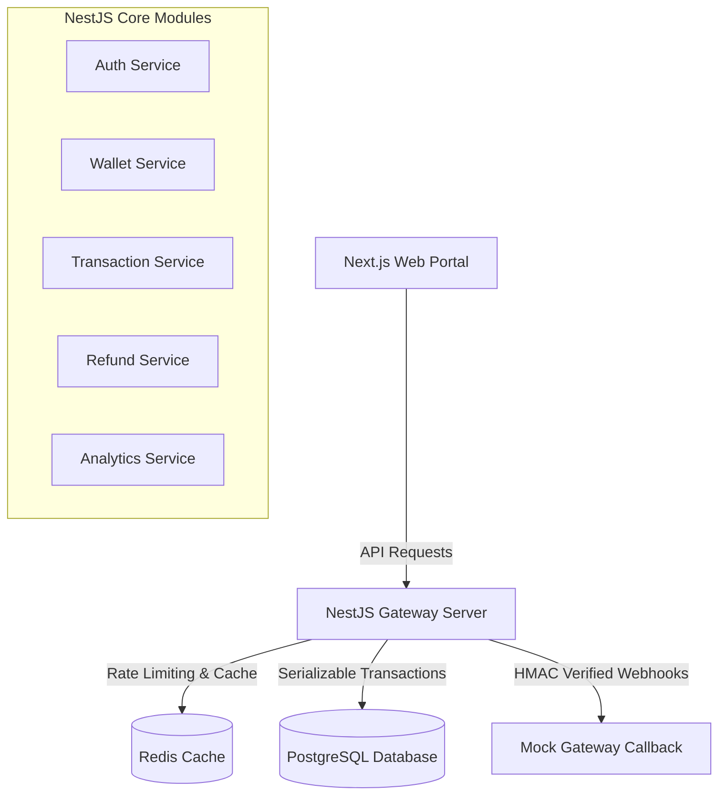

# Regilly Assignment
## Payment Gateway & Wallet Management System

A production-grade, highly secure, and concurrency-safe fintech payment gateway and wallet management system designed for Regilly candidate portals. This system supports candidate wallet top-ups, instant application payment processing, multi-stage state transitions, administrator-approved refund workflows, and real-time dashboard analytics.

---

### 📖 Quick Links
- **NestJS Backend Details**: [backend/README.md](file:///c:/Users/ASUS/Desktop/payment_gateway/backend/README.md)
- **Next.js Frontend Details**: [payment_gateway/README.md](file:///c:/Users/ASUS/Desktop/payment_gateway/payment_gateway/README.md)

---

## 🏗️ System Architecture

The application is structured as a decoupled monorepo containing:
1. **NestJS Backend**: Built on a modular NestJS framework, featuring TypeORM, PostgreSQL, Redis caching, rate limiting, and Winston structured logger.
2. **Next.js Frontend**: A modular Next.js candidate portal featuring dark mode, TanStack React Query for state synchronization, and Recharts for interactive analytics.



### 🔄 System Data Flow
```text
Candidate (User)
       │
       ▼ (Initiate Payment)
   Payment API
       │
       ▼ (Create Transaction in INITIATED state)
  Transaction
       │
       ▼ (Pessimistic Lock on Wallet & Update Balance)
 Wallet Update
       │
       ▼ (Record Transition State in SUCCESS/FAILED)
   Audit Log
```
---

## 🌟 Advanced Production-Grade Features

In addition to standard wallet credits and debits, the portal implements five production-grade enterprise functionalities:

### 1. In-App Real-Time Notification System (Bell & Sliding Drawer)
- **Redis-Backed Unread Tracking**: Employs atomic `INCR`/`DECR` operations on Redis keys (`unread:{userId}`) to query unread badge counts in $O(1)$ time, bypassing database load.
- **Glassmorphic Drawer Layout**: A sliding notifications overlay panel on the Next.js header detailing recent transaction updates, disputes, and request rollbacks with automatic read marking.

### 2. Peer-to-Peer (P2P) Transfer Reversals
- **Compensating Transactions**: Candidates can click a "Rollback" trigger on successful transfers. Approved requests dynamically execute a compensating debit/credit transaction to restore original balances safely.
- **Circular Locking Deadlock Protection**: When transferring balances, user UUIDs are sorted alphabetically before executing Row-Level Locking (`SELECT FOR UPDATE`), eliminating circular dependency deadlocks.

### 3. Interactive Payment Simulations & Admin Verification Queues
- **Simulation Toggles**: Integrated within the transfer checkout step are toggles to simulate a "FAILED" or "PROCESSING" state.
- **Admin Decision Pipeline**: Transactions set to "PROCESSING" bypass automatic gateway resolution and are instead placed into a dedicated Admin Queue for approval or rejection.

### 4. Finite State Machine (FSM) Dispute Resolution
- **FSM State Validation**: Built-in state validation enforcing strict transitions (`OPEN -> UNDER_REVIEW -> RESOLVED/REJECTED`) with constant-time lookup.
- **Conflict Prevention**: Uses a composite database index `idx_dispute_txn_user` to restrict users to a single dispute claim per transaction.

### 5. Velocity Spend Checks & Daily Limits
- **Redis Sliding Window Rate Limiting**: Outgoing transactions are checked against a configured daily spend limit using a Redis-backed sliding window for instant $O(1)$ spend validation.
- **Database Graceful Fallback**: In the event of a Redis outage, the system automatically falls back to aggregation queries on PostgreSQL to calculate total daily spend.

---

## 🛠️ Tech Stack

### Backend
* **Framework**: NestJS (v11.x)
* **ORM**: TypeORM (v0.3.x) with PostgreSQL driver
* **Database**: PostgreSQL (v16+)
* **Caching & Rate Limiting**: Redis (ioredis) & NestJS Throttler
* **Security & Auth**: Passport JWT, Bcrypt password hashing, Crypto HMAC signature validation
* **Logging & Telemetry**: Winston Logger with request-scoped `X-Correlation-ID` tracing

### Frontend
* **Framework**: Next.js (v16.x) App Router
* **Styling**: Tailwind CSS v4 (Sleek dark mode)
* **Icons**: Lucide React
* **State Management & Fetching**: TanStack React Query (v5)
* **Visualization**: Recharts (v3)

---

## 🗄️ Database Design

The database is built on PostgreSQL with strict check constraints and composite/partial indexes for maximum safety and performance.

```
┌─────────────────────────┐         ┌─────────────────────────┐
│          users          │         │         wallets         │
├─────────────────────────┤         ├─────────────────────────┤
│ id (UUID, PK)           │◄───────┐│ id (UUID, PK)           │
│ name (VARCHAR)          │         │ user_id (UUID, FK, UNQ) │
│ email (VARCHAR, UNQ)    │         │ balance (NUMERIC >= 0)  │
│ password_hash (VARCHAR) │         └─────────────────────────┘
│ role (VARCHAR)          │
└─────────────────────────┘
             ▲
             │
             │                      ┌─────────────────────────┐
             ├─────────────────────┐│      transactions       │
             │                     │├─────────────────────────┤
             │                     └│ id (UUID, PK)           │
             │                      │ reference_id (VARCHAR)  │
             │                      │ user_id (UUID, FK)      │
             │                      │ amount (NUMERIC > 0)    │
             │                      │ type (CREDIT | DEBIT)   │
             │                      │ status (INITIATED...)   │
             │                      │ balance_after (NUMERIC) │
             │                      │ request_id (UNQ)        │
             │                      └─────────────────────────┘
             │                                   ▲
             │                                   │
             │                      ┌────────────┴────────────┐
             │                      │         refunds         │
             │                      ├─────────────────────────┤
             │                      │ id (UUID, PK)           │
             │                      │ transaction_id (FK)     │
             │                      │ amount (NUMERIC)        │
             │                      │ status (PENDING...)     │
             └──────────────────────│ approved_by (UUID, FK)  │
                                    └─────────────────────────┘
```

### Key Optimizations (Defined in `schema.sql`)
1. **Pessimistic Wallet Locking**: Updates are performed via `SELECT FOR UPDATE` on user wallets inside `SERIALIZABLE` isolation blocks, preventing dirty reads and race conditions.
2. **Composite Index**: `idx_txn_user_date` on `(user_id, created_at DESC)` ensures candidate dashboards and historical transaction lists load in **< 0.05 ms**.
3. **Partial Index**: `idx_txn_status_partial` on `status WHERE status != 'SUCCESS'` optimizes lookup speeds for active/pending payments by ignoring completed transactions.

---

## 💸 Peer-to-Peer (P2P) Transfers & Security

Candidates can transfer funds directly to other registered candidate accounts and submit payment requests. This flow is guarded by several production-grade security and concurrency protocols:

### 1. Alphabetical UUID Sorted Locking (Deadlock Prevention)
When User A sends money to User B, and User B sends to User A concurrently, databases can deadlock if locks are acquired in different orders (e.g., Transaction 1 locks A then B; Transaction 2 locks B then A). 
To prevent this, the system **sorts the user UUIDs alphabetically** before acquiring database locks:
```typescript
const sortedUserIds = [senderId, recipientId].sort();
// Lock sortedUserIds[0] first, then lock sortedUserIds[1]
```
This guarantees that both concurrent transfers acquire locks on User A first, then User B, entirely eliminating deadlocks.

### 2. Transaction PIN Brute-Force Lockout
P2P transfers and payment request approvals require a 6-digit transaction PIN. To prevent brute-force attacks:
- The PIN is hashed using `bcrypt` (10 rounds) and stored in `users.transaction_pin_hash`.
- The system tracks failed entries using `users.pin_attempts` and `users.pin_locked_until`.
- **5 consecutive wrong entries** triggers a **15-minute account lockout**.
- Re-configuring the PIN resets the lockout and attempt counters.

### 3. Payment Request Lifecycle
Payment requests have a formal state machine:
```
PENDING ──► APPROVED (paid via PIN)
   │
   ├──► REJECTED
   └──► EXPIRED (past due limit)
```

---

## ⚡ Concurrency & State Machine

### Concurrency Locking
Under heavy concurrent debit requests (e.g. multiple exam application fees submitted simultaneously), the system enforces:
* **Row-level Locks**: `SELECT ... FOR UPDATE` locks the wallet row, blocking concurrent writers.
* **Serializable Isolation**: If a concurrent update slips past locks, PostgreSQL fails the transaction serialization and rolls back safely.

### Payment State Machine
Transitions are locked to the following path:
```
INITIATED ──► PROCESSING ──► SUCCESS ──► REFUNDED
   │               │
   ▼               ▼
FAILED          FAILED
```
*Invalid transitions (e.g., FAILED ──► SUCCESS or REFUNDED ──► PROCESSING) are rejected automatically at the application layer.*

---

## 🚀 Getting Started

### Prerequisites
* **Node.js**: v20 or higher
* **PostgreSQL**: Local running database on port 5432
* **Redis**: Local running server on port 6379

### Environment Variables
Configure the following in `backend/.env`:
```env
PORT=3001
NODE_ENV=development

DB_HOST=localhost
DB_PORT=5432
DB_USERNAME=postgres
DB_PASSWORD=your_db_password
DB_NAME=payment_gateway_db

REDIS_HOST=127.0.0.1
REDIS_PORT=6379

JWT_SECRET=your_jwt_secret_key
JWT_EXPIRES_IN=24h
WEBHOOK_SECRET=your_webhook_secret_key
```

### 1. Database Setup & Seeding
Run the database initialization and seeder scripts. The demo seeder generates **1 Admin**, **10 Users**, **60 Transactions**, and **5 Refund requests**:
```bash
cd backend
npm install

# Initialize database
node scripts/init-db.js

# Seed demo dataset
node scripts/seed-demo.js
```

### 2. Run the Backend
```bash
cd backend
npm run start:dev
```
The NestJS server will start on `http://localhost:3001`.

### 3. Run the Frontend
```bash
cd payment_gateway
npm install
npm run dev
```
The Next.js candidate portal will start on `http://localhost:3000`.

---

## 🔑 Demo Credentials
Demo credentials are programmatically configured inside the seed data configuration (see [seed-demo.js](file:///c:/Users/ASUS/Desktop/payment_gateway/backend/scripts/seed-demo.js) or [schema.sql](file:///c:/Users/ASUS/Desktop/payment_gateway/schema.sql)). Default credentials for candidate and administrator accounts are set to local testing profiles:

| Role | Username | Starting Balance | Password Location |
| :--- | :--- | :---: | :--- |
| **Candidate (User)** | `user@regilly.com` | ₹2,500.00 | Refer to `seed-demo.js` / `.env.example` |
| **Administrator** | `admin@regilly.com` | ₹10,000.00 | Refer to `seed-demo.js` / `.env.example` |

---

## 📋 API Documentation Summary

### Authentication
* `POST /api/auth/register` - Create a candidate account
* `POST /api/auth/login` - Authenticate and retrieve JWT
* `GET /api/auth/profile` - Retrieve candidate details (JWT protected)

### Wallet
* `GET /api/wallet/balance` - Retrieve current balance
* `POST /api/wallet/credit` - Load funds into wallet
* `POST /api/wallet/debit` - Withdraw/spend funds

### Payments
* `POST /api/payments/initiate` - Initiate a gateway transaction
* `POST /api/payments/verify` - Simulate payment gateway success callback
* `POST /api/payments/webhook` - HMAC-secured webhook handler

### Refunds
* `POST /api/refunds/request` - Candidate requests refund for a DEBIT transaction
* `POST /api/refunds/approve/:id` - Admin approves refund (updates wallet & transition status)
* `POST /api/refunds/reject/:id` - Admin rejects refund

### Analytics & Reports
* `GET /api/analytics/daily` - Get 14-day transaction trend stats (cached in Redis)
* `GET /api/reports/export` - Export transaction logs to CSV with custom date filters

---

## 🛡️ Security Features & OWASP Hardening
1. **Dynamic Environment Configuration**: Connection details are loaded dynamically from environment configurations via `dotenv` without any hardcoded credentials fallback (remediates OWASP Security Misconfiguration).
2. **Timing-Safe HMAC Webhook Verification**: Gateway callbacks are protected with SHA-256 HMAC signatures computed from request payloads and the shared `WEBHOOK_SECRET`. String comparisons use `crypto.timingSafeEqual` over pre-hashed signatures to protect against side-channel timing attacks (remediates OWASP Cryptographic Failures).
3. **Idempotency Key Guard**: Each transaction requires a unique `requestId` (UUID or unique key). Duplicate requests are intercepted, preventing double-debits.
4. **Role-Based Access Control (RBAC)**: Route guards inspect JWT roles; admins are restricted from user wallet actions, and users cannot access refund approval or admin listings (remediates OWASP Broken Access Control).
5. **HTTP Defense-in-Depth Headers (Helmet)**: Express `helmet` middleware is registered to apply standard security headers, mitigating MIME-sniffing (`X-Content-Type-Options: nosniff`), clickjacking (`X-Frame-Options: SAMEORIGIN`), and forcing SSL/TLS constraints.
6. **Strict Production CORS Policy**: CORS configuration dynamically restricts access to the explicit `FRONTEND_URL` in production, rejecting wildcards or arbitrary origin reflections.
