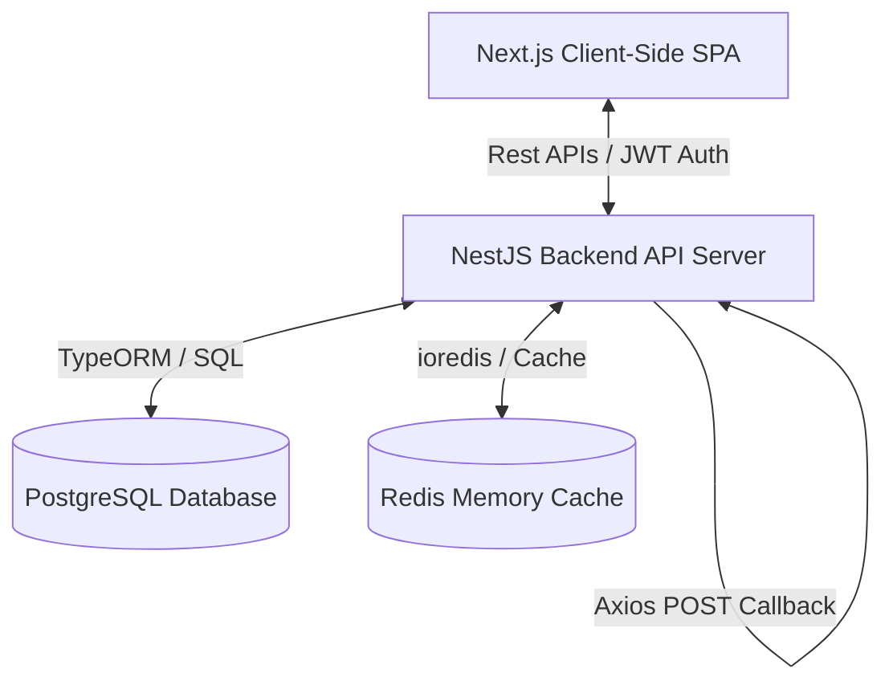
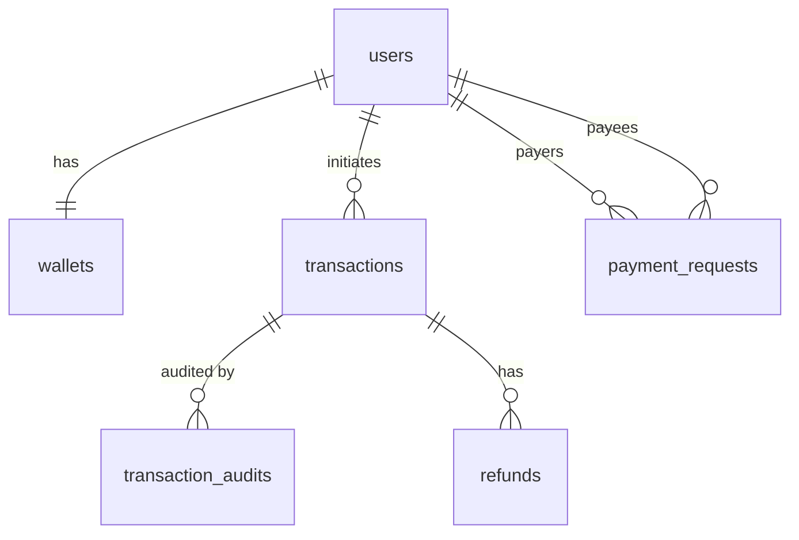

# Technical Explanation & Interview Guide: Payment Gateway Simulation

Welcome to the comprehensive technical documentation for the **Payment Gateway Simulation** project. This guide is specifically compiled to give you a 100% thorough understanding of the architecture, codebase, security features, and concurrency models implemented in this repository. It serves as your primary reference for explaining the project during interviews.

---

## 1. High-Level Architecture

The project is built on a modern full-stack architecture consisting of three primary layers:



### 1.1 Next.js Frontend (`payment_gateway/`)
- **Framework**: Next.js 15 (React 19) using the **App Router** for layout structuring.
- **Styling**: Vanilla CSS combined with custom UI components, implementing a dark-mode theme, glassmorphic card overlays, responsive flexbox grids, and micro-animations for interactive transitions.
- **Routing**: Folder-based file routing:
  - `/login`: User authentication gate.
  - `/dashboard`: High-level metrics visualization (balance, transaction count, analytics chart) with Admin/User mode separation.
  - `/wallet`: Personal balance management, transaction history, funds load, and direct transfer interface.
  - `/transactions`: Sortable and paginated log of all transactions.
  - `/admin`: Superuser view to review statistics, manage audits, trigger refunds, and trace transaction lifecycles.
- **State Management & Fetching**: Standard React context coupled with central api helpers using native fetch wrapped in bearer authentication tokens (JWT).

### 1.2 NestJS Backend (`backend/`)
- **Framework**: NestJS (TypeScript-based enterprise Node.js framework).
- **Core Modules**:
  - `AuthModule`: Handles user signup, login, password hashing (via `bcrypt`), JWT generation, and route guards (`JwtAuthGuard`).
  - `WalletsModule`: Controls balance modifications (credits, debits, transfers) and PIN verifications.
  - `TransactionsModule`: Coordinates transaction initializations, state machine transitions, filtering, and audit log generation.
  - `PaymentsModule`: Simulates the payment gateway interaction (generating checkout orders, checking signatures, and processing webhook callbacks).
  - `AnalyticsModule`: Collects daily transaction aggregations and handles caching.
  - `RedisModule`: Instantiates connection client to Redis server with fail-safe recovery patterns.

---

## 2. Database Schema & Relationships

The database is powered by PostgreSQL. The tables and relationships are defined in [schema.sql](file:///c:/Users/ASUS/Desktop/payment_gateway/schema.sql) and mapped using TypeORM entities.



### 2.1 Table Breakdown

1. **`users`**: Represents application accounts.
   - Fields: `id` (UUID PK), `name`, `email` (Unique), `password_hash`, `pin_hash` (4-digit wallet security PIN), `role` (`admin` or `user`), timestamps.
2. **`wallets`**: Stores current balances.
   - Fields: `id` (UUID PK), `user_id` (UUID FK to `users` Unique), `balance` (Numeric 15,2), timestamps.
3. **`transactions`**: Holds ledger logs of all money movements.
   - Fields: `id` (UUID PK), `reference_id` (Unique checkout reference), `user_id` (UUID FK to `users`), `amount` (Numeric 15,2), `type` (`CREDIT`, `DEBIT`, or `TRANSFER`), `status` (`INITIATED`, `PROCESSING`, `SUCCESS`, `FAILED`, `REFUNDED`), `request_id` (Idempotency key), `balance_after` (Snapshot of wallet balance after transaction application), `gateway_order_id`, `gateway_payment_id`, timestamps.
4. **`transaction_audits`**: Read-only historical ledger log of all state machine transitions.
   - Fields: `id` (UUID PK), `transaction_id` (UUID FK to `transactions`), `from_status`, `to_status`, `actor` (`user`, `system`, `gateway_webhook`), `correlation_id` (Traceability UUID), timestamps.
5. **`refunds`**: Logs details of refunded transactions.
   - Fields: `id` (UUID PK), `transaction_id` (UUID FK to `transactions` Unique), `amount`, `reason`, timestamps.
6. **`payment_requests`**: Facilitates the "Request Money" feature.
   - Fields: `id` (UUID PK), `payer_id` (UUID FK to `users`), `payee_id` (UUID FK to `users`), `amount`, `status` (`PENDING`, `APPROVED`, `REJECTED`), timestamps.
7. **`daily_transaction_stats`**: Pre-aggregated metrics for dashboard charts.
   - Fields: `date` (Date PK), `success_count`, `failed_count`, `total_volume` (Numeric 15,2), timestamps.

### 2.2 Database Index Optimizations
To ensure high performance at scale, the database utilizes key indexes:
- **`idx_txn_user_date`**: Composite index on `(user_id, created_at DESC)` to rapidly fetch the transaction history page for a user.
- **`idx_txn_status`**: Partial index on `(status)` for transactions to quickly load records in specific phases (e.g., `PROCESSING` or `INITIATED`).
- **`idx_wallets_user`**: Unique index on `(user_id)` to speed up balance queries and lock acquisition.

---

## 3. Concurrency Control & Database Safety (Crucial Interview Topic)

Handling concurrent financial transactions safely without losing money, double-spending, or locking up the database is the most technically complex aspect of this project.

### 3.1 Row-Level Locking (`SELECT FOR UPDATE`)
When credits or debits occur, we must prevent **Race Conditions** (e.g., two concurrent threads reading a balance of $100, both subtracting $40, and writing $60 back, resulting in a lost update).
- **Implementation**: The database client locks the balance row using TypeORM's `pessimistic_write` lock mode:
  ```typescript
  const wallet = await manager.getRepository(Wallet).findOne({
    where: { userId },
    lock: { mode: 'pessimistic_write' },
  });
  ```
- **SQL Equivalent**: `SELECT * FROM wallets WHERE user_id = $1 FOR UPDATE;`
- **Result**: Any other transaction trying to read or write this wallet's balance must block and wait until the current transaction commits or rolls back.

### 3.2 Deadlock Prevention in P2P Transfers
A **Deadlock** happens when Thread A locks Wallet 1 and waits for Wallet 2, while Thread B locks Wallet 2 and waits for Wallet 1. They block each other forever, causing a database timeout.
- **Prevention Strategy (Lock Ordering)**: The system always acquires locks in a deterministic order. Before acquiring locks for sender and recipient wallets, we sort their user IDs alphabetically:
  ```typescript
  // Sort userIds alphabetically to establish lock hierarchy
  const sortedUserIds = [senderId, recipient.id].sort();

  // Acquire locks in deterministic order
  const walletA = await walletRepo.findOne({
    where: { userId: sortedUserIds[0] },
    lock: { mode: 'pessimistic_write' },
  });
  const walletB = await walletRepo.findOne({
    where: { userId: sortedUserIds[1] },
    lock: { mode: 'pessimistic_write' },
  });
  ```
- **Result**: Whether User A is sending money to User B, or User B is sending to User A, both concurrent threads will lock the wallets in the exact same alphabetical order. This breaks the circular wait condition and makes deadlocks mathematically impossible.

### 3.3 Serializable Transactions
To prevent **Write Skew** or **Phantom Reads** when transitioning transaction states, the backend executes state machine changes and balance adjustments under TypeORM's highest isolation level:
- **Implementation**:
  ```typescript
  return this.dataSource.transaction('SERIALIZABLE', async (txnManager) => {
    // Row-level loads, state checks, balance updates, audit entries
  });
  ```
- **Result**: Ensures that transactions execute as if they were strictly serial (one after another), guaranteeing ledger integrity.

### 3.4 Idempotency Protection
- **Problem**: A user clicks the "Pay Now" button twice in rapid succession due to lag, sending duplicate requests.
- **Solution**: Every transaction requires a unique `requestId` (generated by the client). The database enforces a `UNIQUE` constraint on `transactions.request_id`.
- **Implementation**: The backend performs a search for the `requestId` before creating a transaction. If found, it returns the existing transaction immediately instead of processing a new one:
  ```typescript
  const existing = await this.transactionRepository.findOne({ where: { requestId } });
  if (existing) return existing;
  ```
  If concurrent threads try to insert the same key, PostgreSQL's unique index throws a constraint violation, blocking duplicate records.

---

## 4. Webhook Architecture & Cryptographic Verification

A production-grade payment system cannot rely on the client frontend reporting the success of a payment. The backend must receive a direct server-to-server callback (Webhook) from the payment gateway.

```
+-----------------+                 +-------------------+                 +-----------------+
|   Next.js App   |                 |    Mock Gateway   |                 |  NestJS Backend |
|                 |                 |                   |                 |                 |
|  Verifies Form  |---------------->|   Initiates Order |                 |                 |
|  Submits Payment|                 |   Computes Sig    |                 |                 |
|                 |                 |                   |                 |                 |
|  Receives Sig   |<----------------|-------------------|---------------->|  Validates DTO  |
|  Triggers Web   |                 |                   |                 |  Saves Order ID |
|                 |                 |  Fires Webhook    |                 |                 |
|                 |                 |  HMAC Signature   |---------------->| Verify Signature|
|                 |                 |                   |                 | Adjust Balance  |
+-----------------+                 +-------------------+                 +-----------------+
```

### 4.1 HMAC SHA-256 Webhook Verification
To prevent malicious actors from spoofing payments by sending fake HTTP POST requests to our webhook endpoint, the payload is cryptographically signed using an HMAC SHA-256 key.
1. **Mock Gateway Signing**: The gateway aggregates payload parameters (order ID, amount, status, etc.) as a JSON string, then signs it using a shared secret key:
   ```typescript
   const signature = createHmac('sha256', this.webhookSecret)
     .update(JSON.stringify(payload))
     .digest('hex');
   ```
2. **Backend Validation**: The webhook endpoint receives the payload and checks the header `x-gateway-signature`. It computes the HMAC signature locally using the same payload and secret key, and compares the values:
   ```typescript
   verifyWebhookSignature(payload: any, signature: string): boolean {
     const payloadStr = JSON.stringify(payload);
     const expectedSignature = createHmac('sha256', this.webhookSecret)
       .update(payloadStr)
       .digest('hex');
     return signature === expectedSignature;
   }
   ```
   If the signatures match, the request is trusted and finalized.

### 4.2 Webhook Idempotency & State Machine Protection
Webhooks can be sent multiple times by gateways in case of network retries.
- The webhook handler uses a database transaction to lock the transaction row.
- It checks if the status is already `SUCCESS` or `FAILED`. If it is, it returns `200 OK` instantly and ignores the payload to prevent double-crediting/debiting:
  ```typescript
  if (txn.status === TransactionStatus.SUCCESS || txn.status === TransactionStatus.FAILED) {
    return;
  }
  ```

---

## 5. Caching Strategy (Redis)

To avoid stressing the PostgreSQL database with redundant aggregation queries, we implement Redis caching on expensive reads, such as weekly or monthly dashboards.

- **Implementation**: Managed inside [analytics.service.ts](file:///c:/Users/ASUS/Desktop/payment_gateway/backend/src/modules/analytics/analytics.service.ts).
- **Cache Hit / Cache Miss Pattern**:
  - When a user views the analytics dashboard, the system checks Redis for the key `analytics_summary_weekly`.
  - **Cache Hit**: If present, it parses the cached JSON and returns it immediately (eliminating database queries).
  - **Cache Miss**: If absent, it queries PostgreSQL, aggregates success rates and total transaction volume, saves the result to Redis with a Time-To-Live (TTL) of 300 seconds (5 minutes), and returns the summary.
- **Cache Eviction**:
  - When a transaction is finalized (SUCCESS or FAILED), `updateDailyStats()` is called. It invalidates the cache immediately by deleting the keys from Redis:
    ```typescript
    await this.redisService.del('analytics_summary_weekly');
    await this.redisService.del('analytics_summary_monthly');
    ```
  - This ensures that the next request retrieves fresh, up-to-date data.
- **Fail-Safe Fallback**: If Redis is offline, the service intercepts the connection error, logs a warning, and falls back directly to database queries. The application continues running uninterrupted.

---

## 6. Directory Structure & File Map

Here is the clean, reorganized structure of the repository. All non-production tools, test suites, and database seeds have been moved out of primary folders into dedicated scripts/test directories.

```
payment_gateway/
├── backend/                        # NESTJS BACKEND
│   ├── scripts/                    # Scripts & seeds folder (No functional code)
│   │   ├── init-db.js              # Verifies & creates PostgreSQL database
│   │   ├── seed.js                 # Seeds primary users and schemas
│   │   ├── seed-demo.js            # Seeds full demo dataset (10 users, wallets, histories)
│   │   ├── check-*.js              # Diagnostics (tables, schemas, connections)
│   │   └── test-*.js               # Scripted database concurrency & Redis testing
│   ├── src/                        # NestJS Source Code
│   │   ├── main.ts                 # App bootstrapping & middleware integration
│   │   ├── app.module.ts           # Imports modules and binds database/redis/config
│   │   └── modules/                # Component modules (Controller, Service, Entity)
│   │       ├── auth/               # User logins, registrations, and token auth guards
│   │       ├── wallets/            # Balance modifications, transfers, PIN checks
│   │       ├── transactions/       # Transaction initialization, listing, state transitions
│   │       ├── payments/           # Orders, signature checks, webhooks, billing requests
│   │       ├── analytics/          # Pre-aggregated daily metrics, analytics summaries
│   │       └── redis/              # Client provider configuration and helpers
│   └── test/                       # E2E Integrations (e.g. p2p.e2e-spec.ts)
│
├── payment_gateway/                # NEXTJS FRONTEND
│   ├── src/                        # Next.js App Source Code
│   │   ├── app/                    # Views/Pages (dashboard, wallet, transactions, admin)
│   │   ├── components/             # Reusable UI widgets (modals, tables, alerts)
│   │   └── services/               # REST API client wrapper (api.ts)
│
├── schema.sql                      # Database Schema Definition (DDL)
├── postman_collection.json         # Postman API Collection (for backend route testing)
└── README.md                       # Setup and run commands reference
```

---

## 7. Interview QA Guide (How to Ace the Interview)

Use these questions and answers to practice before your interview:

### Q1: How do you handle concurrency when modifying a user's wallet balance?
> **Answer**: I use a **Pessimistic Locking** strategy. Within a database transaction, I fetch the wallet row using TypeORM's `pessimistic_write` mode, which translates to a `SELECT ... FOR UPDATE` SQL statement. This locks the specific user's wallet row, blocking any concurrent threads from reading or writing to it until the transaction commits. This prevents classic race conditions like lost updates or double-spending.

### Q2: What happens if two users try to send money to each other at the exact same millisecond? Can it cause a deadlock?
> **Answer**: Yes, in a naive locking system, if User 1 sends to User 2 (locking User 1, waiting for User 2) and User 2 sends to User 1 (locking User 2, waiting for User 1), a deadlock occurs.
> To prevent this, my system implements **Lock Ordering**. Before executing the transfer, we sort the two user IDs alphabetically. We then acquire row-level locks on the wallets in that exact sorted order. Because both concurrent requests lock the accounts in the same sequence, circular waiting is impossible, and deadlocks are avoided entirely.

### Q3: Why do you need both a `verify` endpoint and a `webhook` endpoint for checkout payments?
> **Answer**: The checkout flow splits responsibility.
> 1. The `/payments/verify` endpoint is called by the client immediately after paying on the checkout UI. This verifies the mock signature and transitions the transaction state to `PROCESSING`, giving the user immediate visual feedback.
> 2. The `/payments/webhook` endpoint receives an asynchronous server-to-server callback from the payment gateway. This is the ultimate source of truth. It verifies a secure SHA-256 HMAC signature, finalizes the transaction state to `SUCCESS` or `FAILED`, and adjusts the user's wallet balance in a `SERIALIZABLE` database transaction. This ensures the system is resilient to users closing their browser tab during checkout.

### Q4: How is Idempotency handled in your API?
> **Answer**: Every transaction checkout request contains a unique client-generated `requestId`. We enforce a `UNIQUE` constraint on this column in our PostgreSQL `transactions` table. Before creating any transaction, the server checks if a record with the given `requestId` already exists. If it does, we return the existing transaction. If concurrent requests manage to bypass this check, PostgreSQL throws a unique key violation, preventing duplicate charge records.

### Q5: How does your Redis cache stay consistent with your database?
> **Answer**: I use the **Cache Invalidation** pattern. When a user requests analytics statistics, we check Redis. If there is a cache miss, we load the aggregated data from the PostgreSQL database and write it to Redis with a 5-minute TTL. Whenever a transaction is finalized (and daily statistics are updated), the backend immediately deletes the relevant caching keys (`analytics_summary_weekly` and `analytics_summary_monthly`) using `redisService.del()`. The next request is forced to fetch fresh data from the database.
